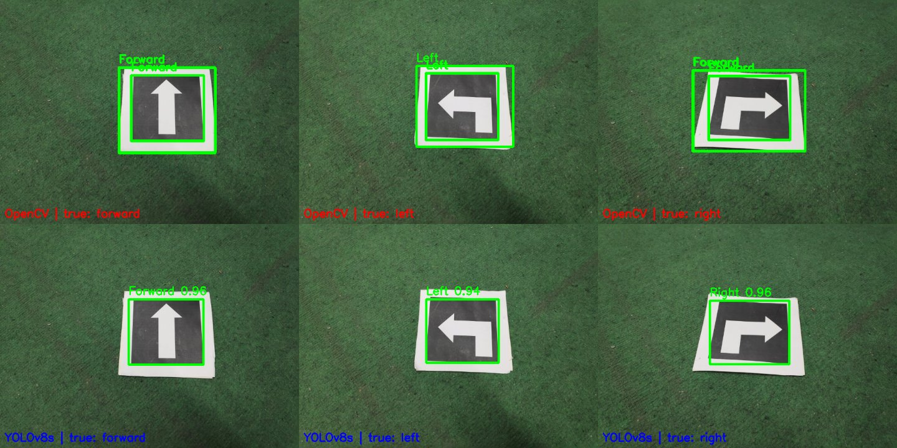

# Autonomous Mobile Robotics: Vision and Navigation

Three robot-vision projects from CPSC-5207EL Autonomous Mobile Robotics at Laurentian
University (Winter 2025, Group 4):

1. **[Arrow marker detection](#1-arrow-marker-detection-opencv-vs-yolov8)**: recognising
   left, right and forward arrow markers from a webcam, with classical OpenCV compared
   against a YOLOv8 model.
2. **[ArUco landmark navigation](#2-aruco-landmark-navigation-ros-2)**: a ROS 2 node that
   finds four ArUco markers, maps them with wheel odometry, and drives to their centre.
3. **[Camera-based cone avoidance](#3-camera-based-cone-avoidance-turtlebot3--gazebo)**: a
   TurtleBot3 that avoids cones and stays on a soccer field in Gazebo using only its camera.

## 1. Arrow marker detection: OpenCV vs YOLOv8

Detects the 10 × 10 cm arrow markers used in the FIRA HuroCup Marathon event and labels them
Left, Right or Forward. Demo video: <https://youtu.be/wm28aawlVCs>



| | OpenCV (geometric) | YOLOv8s |
|---|---|---|
| Method | Canny edges → 4-sided contours → arrow direction from the centroid of the inner shape | YOLOv8s fine-tuned on augmented photos of the 3 markers |
| Speed on a laptop webcam | 30–40 FPS | 20–30 FPS |
| Sample photos above | Forward and left correct, **right misread as forward** | All three correct (0.94–0.96 confidence) |
| Handles rotation, scale, skew | Poorly | Well |

**OpenCV approach** (`track_arrows_cv.py`): grayscale → Gaussian blur → Canny → contours
above 300 px² → keep 4-sided polygons (the marker border) → crop inside the border →
classify by whether the centroid of the largest inner contour falls in the left, middle or
right third. It is fast and needs no training. However, the centroid rule fails when the
arrow's mass sits near the middle, as with the right-turn arrow above. It also draws a box
for both the inner and outer edge of the border.

**YOLOv8 approach** (`track_arrows_yolo.py`): only one photo per marker was available, so
the team used Augmentor (rotation, zoom, skew, shear) to generate 195 images, labelled them
with labelImg, and trained YOLOv8s for 20 epochs at 640 px (175 training, 20 validation
images). The validation scores are precision 0.97, recall 0.96 and mAP50 0.995. The
validation images were augmentations of the same three photos, so those figures overstate
real-world accuracy. The webcam demo is the better guide. The training images are not
included in this repository.

```bash
cd arrow-detection
pip install -r requirements.txt
python track_arrows_cv.py                          # webcam, q to quit
python track_arrows_yolo.py --source samples/right.jpg --save out.jpg
```

`markers/` has the printable markers, and `samples/` has the photos used above.

## 2. ArUco landmark navigation (ROS 2)

`aruco-navigation/aruco_navigator.py` is a ROS 2 Humble node. The robot starts anywhere in a
square area with ArUco markers 1–4 (4×4 dictionary, 16 cm) in the corners. It runs a small
state machine:

1. **Search:** rotate in place until an unvisited marker is near the image centre.
2. **Approach:** drive toward it, steering on the marker's x-offset from
   `estimatePoseSingleMarkers`, until it is 0.5 m away. Then store the robot's odometry
   position as that marker's position. The first marker becomes the map origin.
3. **Go to centre:** once all four are stored, turn until the marker diagonally opposite
   the last one is centred, then drive half the diagonal and stop.

A live OpenCV map shows the markers, the robot's path and the centroid, and is saved as
`robot_map.png`.

**Results:**

- **TurtleBot3 Waffle Pi in Gazebo:** found all four markers and reached the centroid.
- **AgileX LIMO:** found all four markers and computed the centroid correctly. However, it
  turned to the wrong heading in the final step and drove away from the goal.

The team measured the recorded marker positions to be accurate to about 2–3 cm.

**Run it.** Copy the file into a ROS 2 Python package, add an entry point, and build it.

```bash
export TURTLEBOT3_MODEL=waffle_pi    # any other value uses the LIMO topics and camera
ros2 run <your_package> aruco_navigator
```

The node uses the pre-4.7 OpenCV ArUco API (`Dictionary_get`, `estimatePoseSingleMarkers`).
That API is available on the LIMO's OpenCV 4.5.4, or via
`pip install "opencv-contrib-python<4.7"`.

**Limitations:**

- The map relies only on wheel odometry anchored to the first marker, not on full visual
  SLAM.
- The LiDAR is not used, so the robot does not avoid obstacles.
- The final approach turns until a marker is in view rather than steering to the computed
  centroid. That approach depends on the markers forming a square, and it is the step that
  failed on the LIMO.
- This version fixes a bug in the original submission: the half-diagonal distance used a
  marker's x coordinate in place of its y coordinate. The fix has not been re-run on a
  robot.

## 3. Camera-based cone avoidance (TurtleBot3 + Gazebo)

> **Reconstruction.** The original Assignment 3 code was lost. This package was rewritten in
> 2026 from the method described in the team's report, so it is not the code shown in the
> demo video (<https://youtu.be/nSY1SXWT4Ec>). The colour masks and the decision logic were
> checked on synthetic frames. The full simulation has not been run, and the HSV ranges
> will likely need tuning in Gazebo.

`turtlebot3-cone-avoidance/` is a ROS 2 Humble package, `cone_avoidance`. A custom Gazebo
world places six construction cones on the RoboCup 2009 SPL field. The TurtleBot3 Waffle Pi
navigates using only its camera:

1. Keep the bottom half of each frame, since the camera sits close to the ground.
2. Build two HSV masks: one for the cones (orange body plus darker top and base), and one
   for the field boundary (grey floor outside the field plus the yellow and blue goals).
3. Clean each mask with a morphological close, then open.
4. If cone pixels exceed 1.7% of the region, turn clockwise. Otherwise, if boundary pixels
   exceed 15%, turn clockwise. Otherwise, drive forward.

The thresholds match the report's 18,000 and 160,000 pixels on the 1920 × 1080 camera. They
are expressed as fractions, so they don't depend on resolution. Every colour range and
threshold is a ROS parameter.

```bash
cp -r turtlebot3-cone-avoidance ~/turtlebot3_ws/src/cone_avoidance
cd ~/turtlebot3_ws && colcon build --packages-select cone_avoidance && source install/setup.bash
export TURTLEBOT3_MODEL=waffle_pi
ros2 launch cone_avoidance new_world.launch.py
```

The report noted two problems with the original. The robot kept a wide margin from the
field edge, and with a grey-only boundary mask it got stuck at the goalposts; adding the
yellow and blue goal masks fixed that. Building packages one at a time
(`--packages-select`) also avoided crashes on low-memory machines.

## Team

Shazzad Sakim Sourav, Shadman Rashik Ahmed, Md Ashraf Ali and Md Ashaduzzaman (Group 4).
The ROS 2 node started from the course's TurtleBot3 sample code. The arrow-direction rule
was drafted with ChatGPT, as cited in the code.

## License

Code: MIT (see [LICENSE](LICENSE)). The YOLO weights in `arrow-detection/weights/` were
trained with Ultralytics YOLOv8, which is licensed under AGPL-3.0. The weights follow
Ultralytics' terms.
